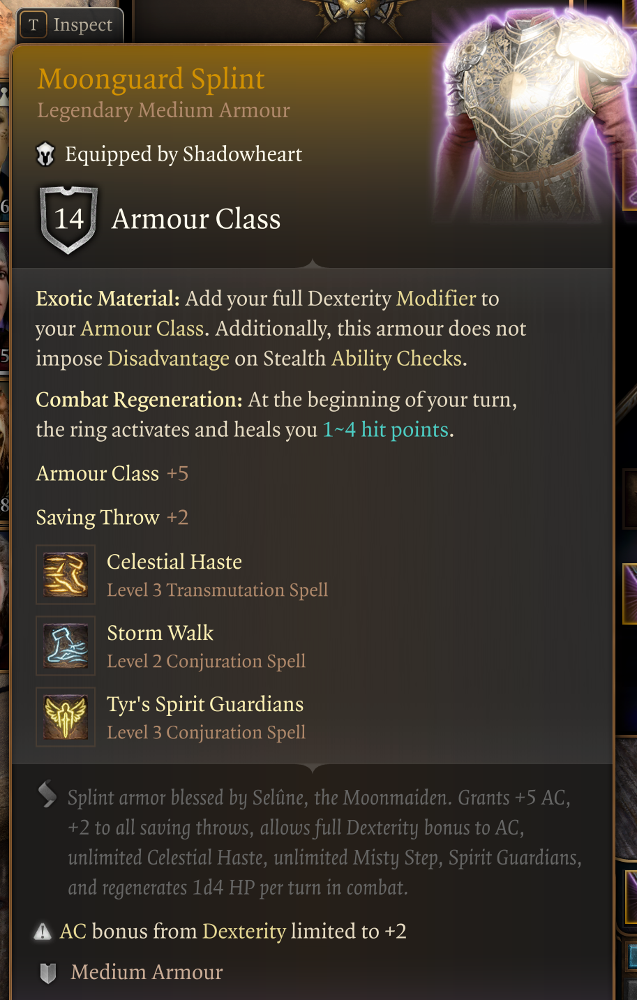
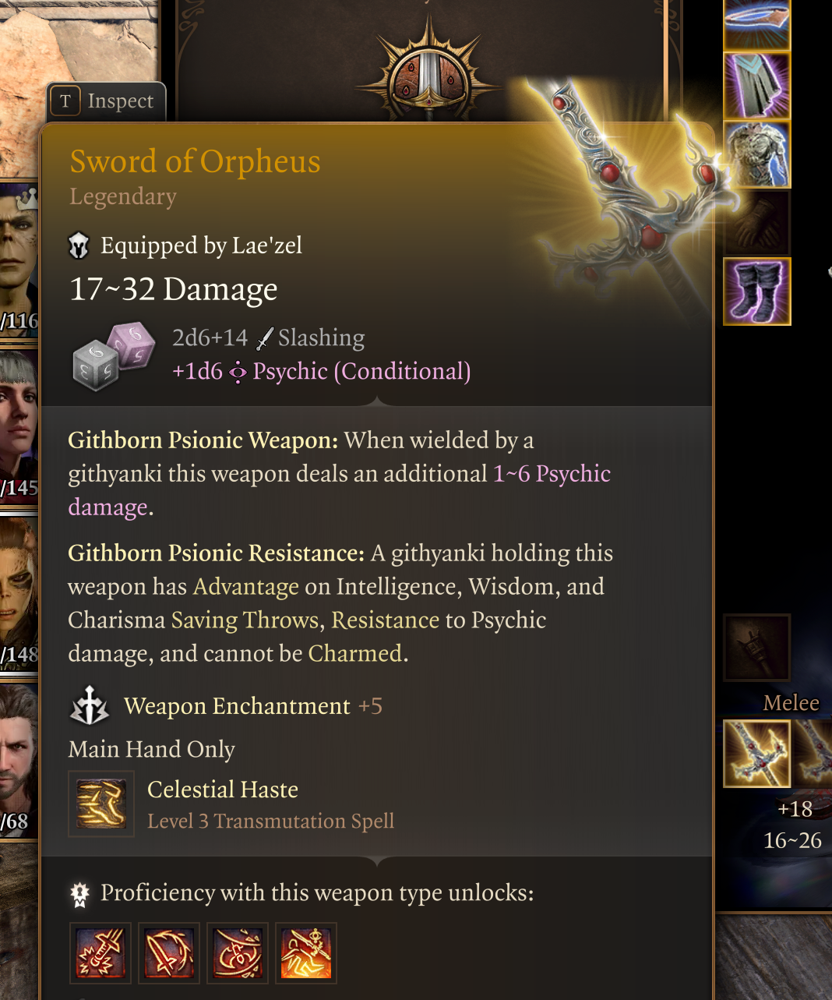
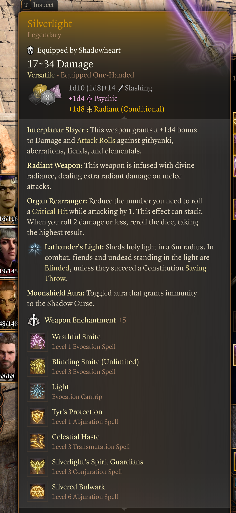
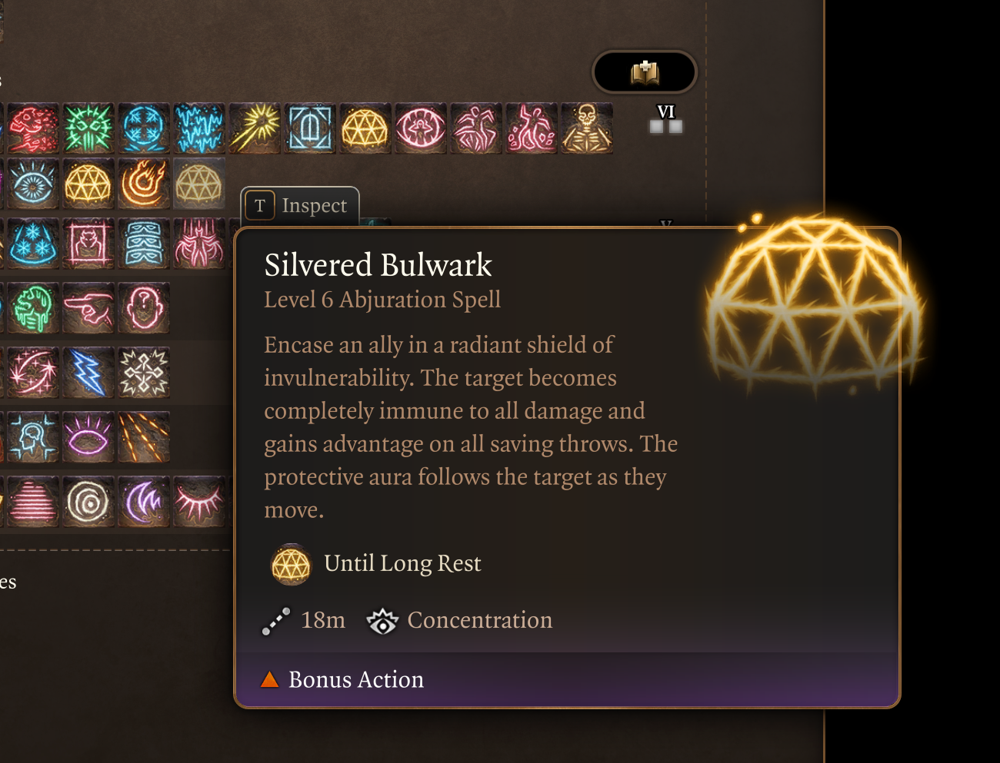
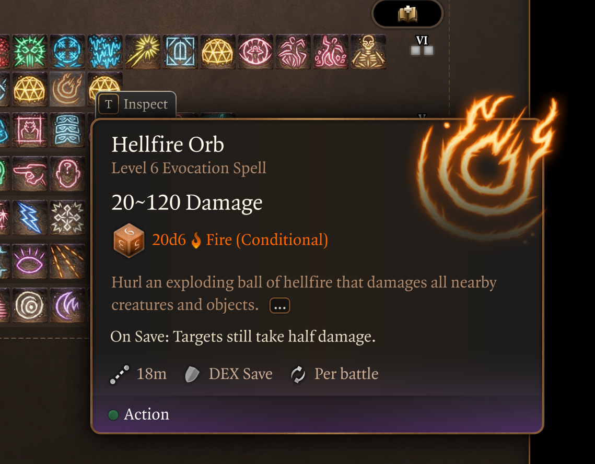

# BG3 Magic Items Mods

A collection of Baldur's Gate 3 mods adding legendary gear, spell scrolls, and utility items. Authored in XML-based `.lsx` mod files and packed with [BG3 Modders Multitool](https://github.com/ShinyHobo/BG3-Modders-Multitool). Developed by **PseudonymousEd** with extensive use of [Claude Code](https://claude.ai/claude-code).

---

## Mods

### Level13PlusGear

Legendary weapons, armor, and accessories designed for level 13+ characters. Items appear in the **Tutorial Chest** at the start of a new game.

Includes:
- Legendary staffs, swords, mauls, maces, and greatswords with powerful passive and active abilities
- Legendary armor (body, head, hands, feet, cloaks, shields)
- Rings with powerful magical effects

**Note:** Tutorial Chest loot is locked in the moment you open it. Adding new items to the mod will not retroactively update an already-opened chest — start a new game to receive new items.

<p align="center">
  
  
</p>

---

### Level21Gear

Legendary gear for level 21+ characters (Honour Mode / post-game tier). Items appear in the **Tutorial Chest**.

Includes:
- Staff of Gimeitaro (extremely powerful caster weapon)
- Silverlight sword
- Silvered Bulwark scroll



---

### SilveredBulwarkScroll

A standalone scroll mod. No dependencies. Items appear in the **Tutorial Chest**.

Both spells exist in the base game but are not normally available to players. This mod makes them accessible via single-use scrolls.

Includes:
- **Scroll of Silvered Bulwark** — Encase an ally in a moveable radiant shield of invulnerability that lasts until dismissed or the next long rest (Level 6 Abjuration)
- **Scroll of Hellfire Orb** — Launch a searing orb that explodes in a 4-metre radius for 20d6 Fire damage (DC 18 Dex save for half)

<p align="center">
  
  
</p>

---

### RingOfCreation

A utility ring that grants spells to summon items by their template ID. Useful for testing and item delivery.

**Dependencies:** Level13PlusGear, SampleMagicRingMod

---

## Tech Stack

BG3 mods are authored as XML-based `.lsx` files (compiled to binary `.lsf` at pack time). Key file types include:

- `.lsx` — item templates, stats, treasure tables, localization handles
- `.pak` — the packed mod format consumed by the game

Tooling used:
- [BG3 Modders Multitool](https://github.com/ShinyHobo/BG3-Modders-Multitool) — packing `.pak` files and unpacking vanilla game data
- [Claude Code](https://claude.ai/claude-code) — AI-assisted item design, file authoring, and cross-referencing game data

---

## Installation

These mods use the standard BG3 mod format. To install:

1. Pack the mod folder using [BG3 Mod Packer](https://github.com/ShinyHobo/BG3-Modders-Multitool) or similar tool into a `.pak` file.
2. Place the `.pak` file in your BG3 mods directory:
   - `%LOCALAPPDATA%\Larian Studios\Baldur's Gate 3\Mods\`
3. Enable the mod in the BG3 Mod Manager or in-game mod list.
4. Start a **new game** — items are delivered via the Tutorial Chest and will not appear in existing saves.

---

## Mod Dependencies

| Mod | Depends On |
|-----|-----------|
| Level13PlusGear | None |
| Level21Gear | None |
| SilveredBulwarkScroll | None |
| RingOfCreation | Level13PlusGear, SampleMagicRingMod |

---

## Repository Structure

```
Level13PlusGear/        # Legendary gear mod (level 13+ characters)
Level21Gear/            # Legendary gear mod (level 21+ characters)
SilveredBulwarkScroll/  # Standalone spell scroll mod
RingOfCreation/         # Utility ring for item summoning
docs/
  phases/               # Phase-by-phase development log
  planning/             # Item catalogs and design notes
  level13plusgear/      # Level13PlusGear item catalog
  silveredbulwarkscroll/ # SilveredBulwarkScroll item catalog
  instructions/         # Technical modding reference docs
```

---

## Development Notes

This repository tracks active mod development. Each development milestone is documented in `docs/phases/` (Phase001.md, Phase002.md, etc.) with goals, implementation details, UUIDs, and test plans.

Key technical reference documents are in `docs/instructions/`:
- `BG3_Modding_Lessons_Learned.md` — hard-won lessons on file structure, item delivery, and debugging
- `armor_workflow.md` — which armor base templates work for container delivery
- `uuid_workflow.md` — UUID naming conventions for Level13PlusGear items
- `interesting_magical_effects.md` — collection of BG3 passives and effects for future items

### Local Development Environment

Two directories exist in the local development environment but are not tracked in this repository:

- **`ExampleMods/`** — A place to drop existing BG3 mods for easy reference while developing. Useful for studying how other mods implement features.
- **`VanillaBG3/`** — A local copy of BG3 game data files (`Gustav/` and `Shared/` subdirectories), extracted directly from the game. Used as a reference for vanilla item templates, stats, and other game content when creating new items.

---

## Development Tools

These mods were developed with extensive use of [Claude Code](https://claude.ai/claude-code), Anthropic's AI coding assistant. Claude Code assisted with item design, file authoring, cross-referencing vanilla game data, and tracking implementation across development phases.

---

## License

This project is provided for personal use and modding reference. See individual mod files for author information.
